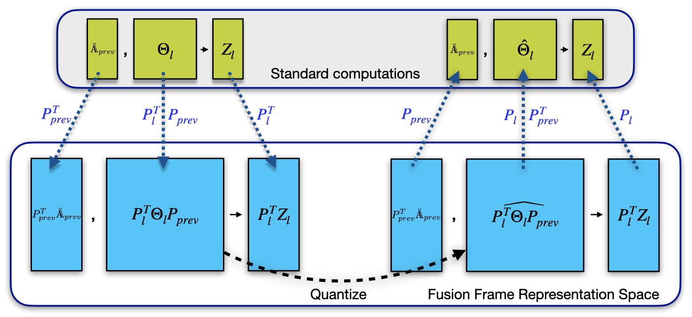
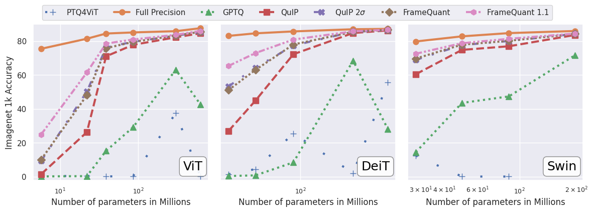

## FrameQuant

This repository contains the code for FrameQuant, a Post-Training-Quantization algorithm for Transformer models. FrameQuant is able to quantize Transformers to ultra low bitwidths(almost 2 bits) while providing flexibility by allowing fractional bitwidths. Please find our paper at [arXiv:2403.06082](https://arxiv.org/abs/2403.06082) for more details on our algorithm and experiments. 



## Installation
All our dependencies are provided in the `requirements.txt`. (We also have a docker image with all of them installed).
```
pip install -r requirements.txt
```
We use the Fast Hadamard Transform implementation from Dao-AILab for our fast random projections. Follow their instructions to install the package or run (from within the FrameQuant directory)
```
bash install_fast_hadamard_tx.sh
```

### Docker image
We also have a docker image with all the packages installed on the dockerhub. From within the FrameQuant directory, simply run
```
docker run --ipc=host --gpus all -it -v "$PWD:/workspace" harshauwm163/fq:0.96
```
to start using FrameQuant.

## Running FrameQuant
### Quantization a model using FrameQuant
This respository contains the code for our core algorithm. We provide implementation for quantizing Llama2 models (more models to come!). Our code is developed on top of [GPTQ](https://github.com/IST-DASLab/gptq) and [GPTQ-for-LLaMa](https://github.com/qwopqwop200/GPTQ-for-LLaMa). Here is the command to run FrameQuant on LLaMa2-7B. 
```
# For Llama model located at /data/hf-llama-2-7b; run

python llama.py /data/hf-llama-2-7b c4 --eval --new-eval --tff_transform --tff_redundancy 1.0 --wbits 2 --save
```

### Inference for a model quantized using FrameQuant
The command below is used for running inference using the quantized model.
```
# /data/hf-llama-2-7b should contain the config files and the tokenizer for the original model
# ./results/Llama_FQ should contain packed_model.ckpt, generated by the quantization script above 

python inference.py /data/hf-llama-2-7b ./results/Llama_FQ
```


## Experimental Results
Here is a comparision of FrameQuant to other PTQ methods.

<details open >
<summary>
Validation accuracy of Quantized Vision Transformers on ImageNet-1K
</summary>



</details>

<details open>
<summary>
Performance of Post Training Quantized (PTQ) LLMs from the Llama2 class on language modeling.
</summary>

<table>
<tr><th style="text-align: center;"> ppl on WikiText2 </th><th style="text-align: center;"> ppl on C4 </th></tr>
<tr><td>

| Method | bits | 7B | 70B |
| :---   | :--- | :--- | :--- |
| Full-Precison| $16$ | $5.68$ | $3.32$ |
| GPTQ | $2$ | $6.4e3$ | $140.5$ |
| QuIP | $2$ | $26.02$ | $6.21$ |
| FrameQuant $1.0$ | $2$ | $14.85$ | $5.50$ |
| FrameQuant $1.1$ | $2.2$ | $8.48$ | $4.67$ |

</td><td>

| Method | bits | 7B | 70B |
| :---   | :--- | :--- | :--- |
| Full-Precison| $16$ | $7.26$ | $5.71$ |
| GPTQ | $2$ | $2265.09$ | $68.83$ |
| QuIP | $2$ | $26.61$ | $8.65$ |
| FrameQuant $1.0$ | $2$ | $19.62$ | $7.85$ |
| FrameQuant $1.1$ | $2.2$ | $11.23$ | $6.86$ |

</td></tr> </table>

</details>


<details>
<summary>
Performance of Post Training Quantized (PTQ) LLMs from the OPT class on language modeling.
</summary>
 

<table>
<tr><th style="text-align: center;"> ppl on WikiText2 </th><th style="text-align: center;"> ppl on C4 </th></tr>
<tr><td>

| Method | bits | 125M | 1.3B | 2.7B | 6.7B |
| :---   | :--- | :--- | :--- | :--- | :--- |
| Full-Precison| $16$ | $27.65$ | $14.62$ | $12.47$ | $10.86$ |
| GPTQ | $2$ | $5.7e3$ | $8.9e3$ | $9.1e3$ | $3.1e3$ |
| QuIP | $2$ | $913.0$ | $37.59$ | $22.86$ | $15.67$ |
| FrameQuant $1.0$ | $2$ | $345.7$ | $30.54$ | $20.67$ | $15.72$ |
| FrameQuant $1.1$ | $2.2$ | $\textbf{131.2}$ | $\textbf{22.68}$ | $\textbf{15.86}$ | $\textbf{13.53}$ |

</td><td>

| Method | bits | 125M | 1.3B | 2.7B | 6.7B |
| :---   | :--- | :--- | :--- | :--- | :--- |
| Full-Precison| $16$ | $26.56$ | $16.07$ | $14.34$ | $12.71$ |
| GPTQ | $2$ | $2203.89$ | $4139.91$ | $4058.91$ | $528.41$ |
| QuIP | $2$ | $543.62$ | $28.91$ | $21.49$ | $16.92$ |
| FrameQuant $1.0$ | $2$ | $226.17$ | $27.90$ | $20.74$ | $17.28$ |
| FrameQuant $1.1$ | $2.2$ | $\textbf{91.29}$ | $\textbf{22.39}$ | $\textbf{17.75}$ | $\textbf{15.33}$ |

</td></tr> </table>

</details>

<details>
<summary>Downstream performance of FrameQuant</summary>
 

The LLMs quantized with FrameQuant also perform better on the downstream tasks. We use [LM-eval-harness](https://github.com/EleutherAI/lm-evaluation-harness) to evaluate Llama2-7B model quantized using various methods on the downstream tasks and show that FrameQuant achieves best performance on all the tasks.

| Method | bits | ARC (challenge) | ARC (easy) | BoolQ | HellaSwag | PIQA | WinoGrande |
| :---   | :--- | :---: | :---: | :---: | :---: | :---: | :---: |
Full-Precision | $16$ | $43.43$ | $76.35$ | $77.71$ | $57.16$ | $78.07$ | $69.06$ |
GPTQ    | $2$ | $22.44$ | $24.58$ | $41.19$ | $25.93$ | $51.85$ | $50.43$ |
QuIP    | $2$ | $22.27$ | $42.76$ | $50.31$ | $34.04$ | $61.75$ | $52.64$ |
FrameQuant $1.0$ | $2$ | $23.98$ | $55.39$ | $63.52$ | $36.76$ | $66.65$ | $55.80$ |
FrameQuant $1.1$ | $2.2$ | $\textbf{31.91}$ | $\textbf{65.53}$ | $\textbf{67.95}$ | $\textbf{46.46}$ | $\textbf{73.07}$ | $\textbf{63.61}$ |

</details>


## Cite
Please do cite our work, if you find it interesting!
```
@InProceedings{adepuFQIcml24,
  author = 	 {Harshavardhan Adepu and Zhanpeng Zeng and Li Zhang and Vikas Singh},
  title = 	 {FrameQuant: Flexible Low-Bit Quantization for Transformers},
  OPTcrossref =  {},
  OPTkey = 	 {},
  booktitle = {Proceedings of International Conference on Machine Learning (ICML)},
  OPTpages = 	 {},
  year = 	 {2024},
  venue = 	 {ICML},
  OPTeditor = 	 {},
  OPTvolume = 	 {},
  OPTnumber = 	 {},
  OPTseries = 	 {},
  OPTaddress = 	 {},
  month = 	 {July},
  OPTorganization = {},
  OPTpublisher = {},
  OPTnote = 	 {},
  OPTannote = 	 {}
}
```
